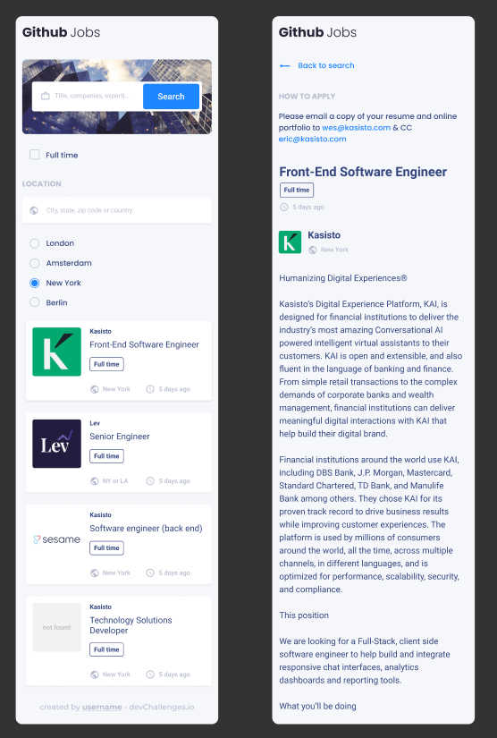

# Jobs

Crear una aplicación web dinámica para busque de trabajo.

## Desing

### Index

### Detalles

### Responsive

Ver [Figma](https://www.figma.com/file/gAkVx9CdOqnJcCjJ7nVNkw?chrome=DOCUMENTATION%22&embed_host=astra&kind=&node-id=0%3A1&viewer=1).

## Complete las historias de usuario a continuación

- Yo como usuario no registrado en la web puedo ver una lista de ofertas de trabajo en una ciudad por defecto.

- Yo como usuario no registrado en la web puedo buscar ofertas de trabajo con una palabra clave.

- Yo como usuario no registrado en la web puedo buscar ofertas de trabajo mediante el nombre de la ciudad, zip u otra localización

- Yo como usuario no registrado en la web puedo seleccionar una opción de cuatro opciones predefinidas por ciudad.

- Yo como usuario no registrado en la web puedo buscar solamente por ofertas de trabajo de tiempo completo.

- Yo como usuario no registrado en la web puedo ver una lista de ofertas de trabajo con su logo, nombre de la compañía, localización, y hace cuanto fue publicada.

- Cuando yo selecciono una oferta de trabajo, Yo como usuario no registrado en la web puedo ver la descripción y como puedo aplicar a la oferta de trabajo.

- Cuando estoy en la página de detalles de la oferta de trabajo, Yo como usuario no registrado en la web puedo regresar a la página de búsqueda.

- Yo como usuario no registrado en la web puedo ver ofertas de trabajo en diferentes páginas, cinco (5) ítems en cada página.

- (Opcional) Y como usuario puedo ver la lista de ofertas de trabajo que se encuentran cercanas a una ciudad desde mi localización por defecto.

## Referencias

El caso de estudio y las imágenes son material público tomado de: [Devchallenges.io](https://devchallenges.io/challenges/TtUjDt19eIHxNQ4n5jps). Y se utilizaran como guía de requisitos para un ejercicio académico.
